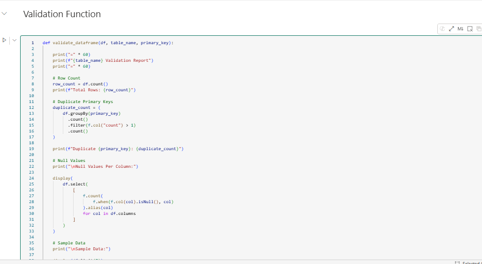
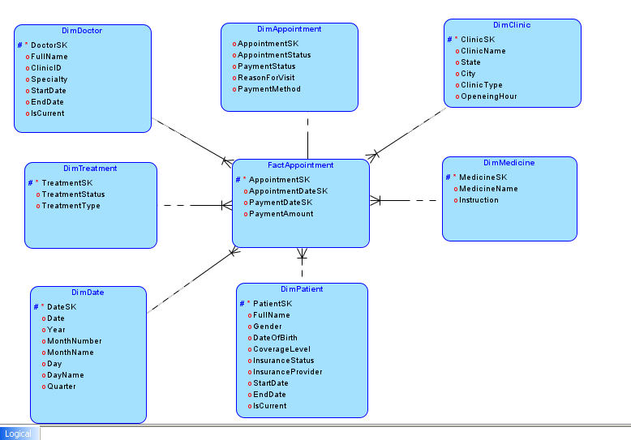
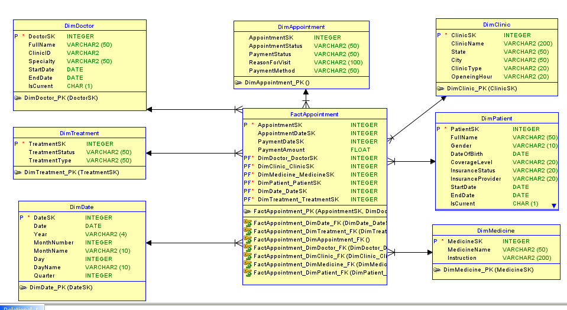
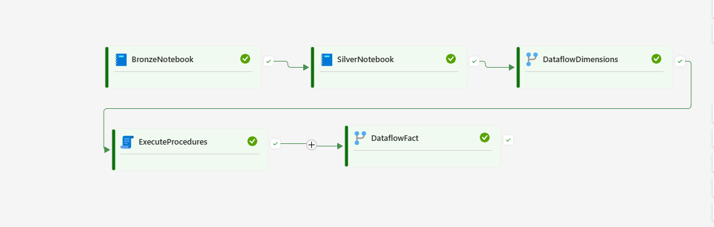
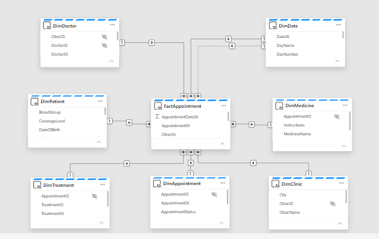
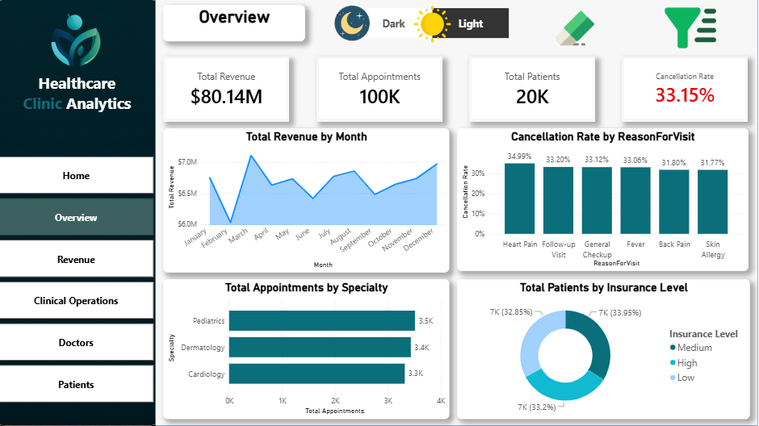
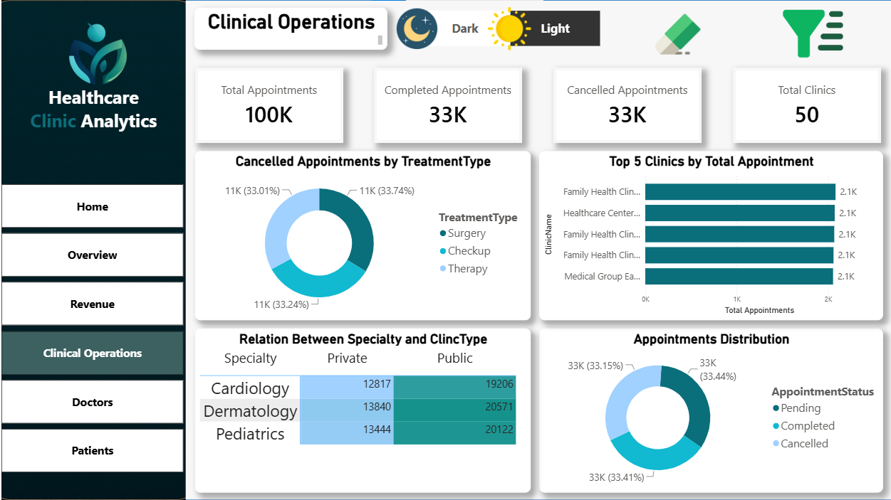
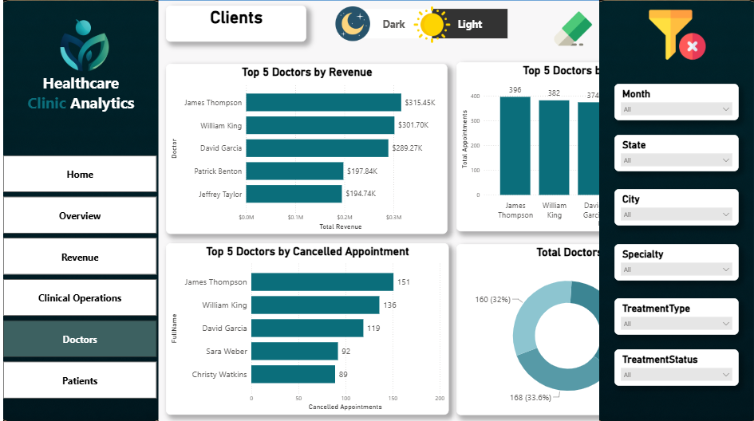
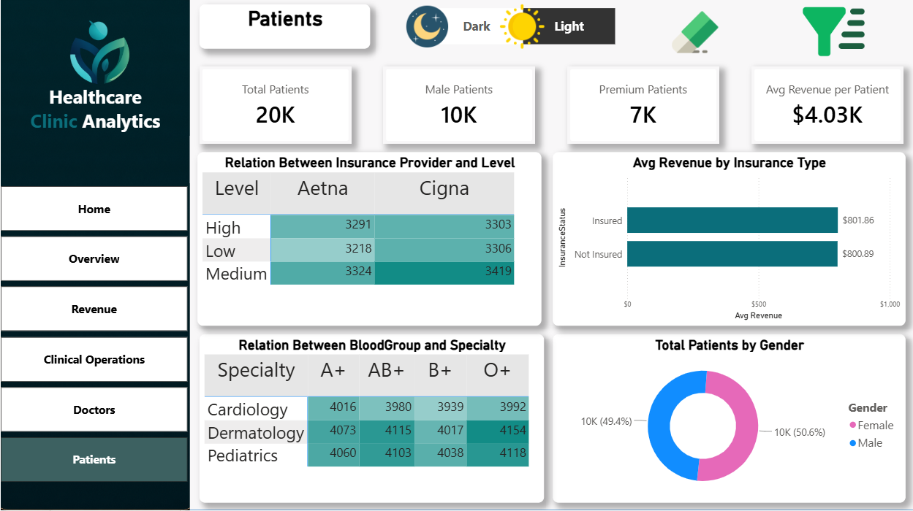
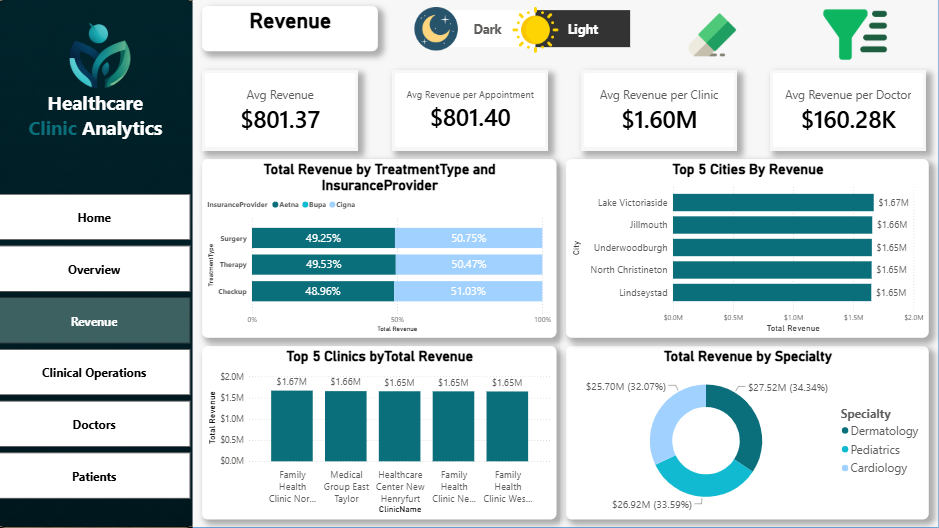

# 🏥 Healthcare Clinic

<p align="center">
  
</p>

<h3 align="center">
  End-to-End Healthcare Data Engineering & Business Intelligence Platform
</h3>

<p align="center">
  Built with Microsoft Fabric, Lakehouse, Data Warehouse, SQL, Dataflow Gen2 and Power BI
</p>

---

## 📌 Project Overview

This project is an **end-to-end Healthcare Data Platform** built using **Microsoft Fabric**.

The solution transforms raw healthcare data into a structured analytical platform through a **Medallion Architecture**, followed by dimensional modeling, historical data tracking, semantic modeling, and Power BI reporting.

The complete data flow is:

```text
Source Data
     ↓
Bronze Lakehouse
     ↓
Silver Lakehouse
     ↓
Gold / Data Warehouse
     ↓
Semantic Model
     ↓
Power BI
```

The project covers:

* Data ingestion
* Incremental loading
* Data cleaning
* Data validation
* Data transformation
* Dimensional modeling
* Star Schema
* Surrogate Keys
* SCD Type 2
* SQL Stored Procedures
* Dataflow Gen2
* Pipeline orchestration
* Semantic Model
* Power BI dashboards

---

# 🏗️ Architecture

The platform follows a **Medallion Architecture** with three main data layers.

```text
                         ┌──────────────────────┐
                         │     Source Data      │
                         │  Healthcare Datasets │
                         └──────────┬───────────┘
                                    │
                                    ▼
                         ┌──────────────────────┐
                         │   Bronze Lakehouse   │
                         │      Raw Layer       │
                         └──────────┬───────────┘
                                    │
                                    ▼
                         ┌──────────────────────┐
                         │   Silver Lakehouse   │
                         │ Clean + Validated    │
                         └──────────┬───────────┘
                                    │
                                    ▼
                         ┌──────────────────────┐
                         │      Gold Layer      │
                         │   Data Warehouse     │
                         └──────────┬───────────┘
                                    │
                       ┌────────────┴────────────┐
                       ▼                         ▼
                Dimension Tables            Fact Tables
                  + SCD Type 2             FactAppointment
                       │                         │
                       └────────────┬────────────┘
                                    ▼
                         ┌──────────────────────┐
                         │    Semantic Model    │
                         └──────────┬───────────┘
                                    │
                                    ▼
                         ┌──────────────────────┐
                         │      Power BI        │
                         │      Dashboards      │
                         └──────────────────────┘
```

---

# 🥉 Bronze Layer

The **Bronze Layer** is the raw data ingestion layer.

Its purpose is to ingest source healthcare data while preserving the original information and preparing it for downstream processing.

### Key Activities

* Source data ingestion
* Raw data storage
* Incremental data loading
* Metadata handling
* Preparing data for Silver transformations

---

## 📥 Import Data Source

The first step is importing the healthcare source data into the Bronze Layer.


---

## 🔄 Incremental Load to Bronze

An incremental loading mechanism was implemented to process only the required data instead of reprocessing the entire source dataset.


---

# 🥈 Silver Layer

The **Silver Layer** is responsible for converting raw data into clean, standardized, and validated datasets.

### Key Activities

* Data cleansing
* Data type standardization
* Handling missing values
* Duplicate handling
* Data validation
* Data transformation
* Incremental processing
* Preparing data for the Gold Layer

---

## 📥 Incremental Data Extraction

The Silver process extracts the required data incrementally from the Bronze Layer.


---

## 🔀 Merge Data Into Server

After processing the data, the transformed records are merged into the target structures.


---

## ✅ Data Validation

Validation steps are performed to make sure that the transformed data satisfies the expected data quality requirements before moving to the Gold Layer.



---

# 🥇 Gold Layer

The **Gold Layer** contains business-ready data designed for analytics and reporting.

The Gold Layer is implemented using a **Data Warehouse** and includes:

* Fact tables
* Dimension tables
* Surrogate keys
* Historical tracking
* Business-ready relationships
* Analytical structures

---

# 🧩 Dimensional Modeling

The project follows a **Star Schema** approach.

### Fact Table

* `FactAppointment`

### Dimension Tables

* `DimPatient`
* `DimDoctor`
* `DimClinic`
* `DimMedicine`
* `DimTreatment`
* `DimDate`
* `DimAppointment`

The Star Schema separates measurable business events from descriptive attributes, making the model easier to analyze through Power BI.

---

# 📐 Data Modeling

The data model was designed through three stages:

```text
Conceptual Model
       ↓
Logical Model
       ↓
Physical Model
```

---

## 🧠 Conceptual Model

The conceptual model defines the main healthcare entities and their high-level relationships.


---

## 🔗 Logical Model

The logical model provides a more detailed representation of entities, attributes, and relationships.



---

## 🗄️ Physical Model

The physical model represents the actual database implementation, including tables, keys, and relationships.



---

# 🔑 Surrogate Keys

Surrogate Keys were used in the dimensional model instead of relying only on source business keys.

The general process is:

```text
Business Key
      ↓
Dimension Lookup
      ↓
Surrogate Key
      ↓
Fact Table
```

This approach supports:

* Stable warehouse relationships
* SCD Type 2
* Historical tracking
* Efficient fact-to-dimension relationships

---

# 🔄 SCD Type 2

**Slowly Changing Dimension Type 2** was implemented to preserve historical changes in dimension records.

Instead of overwriting an existing record when an attribute changes, the old version is preserved and a new version is created.

This allows the warehouse to answer historical questions such as:

> What was the value of an attribute at a specific point in time?

Typical SCD Type 2 columns include:

```text
BusinessKey
SurrogateKey
Attribute Values
StartDate
EndDate
IsCurrent
```

### SCD Type 2 Stored Procedure


---

# 🔄 Dataflow Gen2

**Dataflow Gen2** is used to load the Gold Layer.

Separate dataflows were implemented for the Dimension and Fact loading processes.

---

## 📊 Dimension Dataflow

The Dimension Dataflow is responsible for preparing and loading the dimension tables.


---

## 📈 Fact Dataflow

The Fact Dataflow loads the healthcare business events into the fact table after resolving the required dimension keys.


---

# 🗃️ SQL & Stored Procedures

SQL is used within the Data Warehouse for database-side processing and SCD Type 2 implementation.

The repository contains:

```text
SQL/
├── Exec Stored Proc.sql
└── Stored_Procedures.sql
```

### Stored Procedure Execution

The execution scripts are used to execute the required warehouse procedures.

### Stored Procedure Logic

The stored procedure scripts contain the SQL logic required for the warehouse processing, including historical dimension handling.

---

# 🔁 Pipeline & Orchestration

The complete data workflow is orchestrated using a **Microsoft Fabric Pipeline**.

The pipeline controls the execution order and dependencies between the different processing components.

```text
Source
  ↓
Bronze Notebook
  ↓
Silver Notebook
  ↓
Dimension Dataflow
  ↓
SCD Type 2
  ↓
Fact Dataflow
  ↓
Data Warehouse
  ↓
Semantic Model
  ↓
Power BI
```



---

# 🧠 Semantic Model

The **Power BI Semantic Model** is built on top of the Gold/Data Warehouse layer.

It provides a business-friendly analytical layer containing:

* Relationships
* Dimensions
* Fact tables
* Measures
* Analytical calculations
* Business-ready structures



---

# 📊 Power BI Dashboard

The final analytical layer was developed using **Power BI**.

The report contains multiple pages designed to provide different views of the healthcare business.

---

## 🎨 Cover Page

The Cover page provides the entry point to the Power BI report and introduces the healthcare analytics solution.


---

## 📊 Overview

The Overview page provides a high-level view of the healthcare operation and summarizes the most important KPIs.



---

## 🏥 Clinic Analysis

The Clinic page focuses on clinic-level analysis and provides insights into clinic activity and performance.



---

## 👨‍⚕️ Doctors Analysis

The Doctors page provides analytical insights into doctors and their healthcare activities.



---

## 👥 Patients Analysis

The Patients page focuses on patient-related information and healthcare activity.



---

## 💰 Revenue Analysis

The Revenue page provides financial insights and focuses on revenue-related metrics.



---

# 📓 Notebooks

The repository contains the notebooks used for the Bronze and Silver data processing layers.

```text
Notebooks/
├── Bronze.ipynb
└── Silver.ipynb
```

### Bronze Notebook

Responsible for:

* Source ingestion
* Raw data processing
* Incremental loading

### Silver Notebook

Responsible for:

* Data cleaning
* Transformation
* Validation
* Incremental processing
* Preparing data for the Gold Layer

---

# 🗄️ Power BI Project File

The complete Power BI report is included in the repository:

```text
Power BI/
└── HealthCare.pbix
```

The PBIX file contains the final Power BI report and its analytical pages.

---

# 🛠️ Technologies Used

| Technology           | Purpose                                    |
| -------------------- | ------------------------------------------ |
| **Microsoft Fabric** | End-to-end data platform                   |
| **Lakehouse**        | Bronze and Silver layers                   |
| **Fabric Warehouse** | Gold analytical layer                      |
| **Dataflow Gen2**    | Data transformation and loading            |
| **Python / PySpark** | Notebook-based data processing             |
| **SQL**              | Warehouse processing and Stored Procedures |
| **SCD Type 2**       | Historical dimension tracking              |
| **Power BI**         | Data visualization and analytics           |
| **Semantic Model**   | Business-facing analytical layer           |

---

# 📁 Repository Structure

```text
healthcare-clinic-data-platform/
│
├── Img/
│   │
│   ├── Bronze/
│   │   ├── Import data source.png
│   │   └── Incremental to Bronze.png
│   │
│   ├── Gold/
│   │   ├── DataFlow Dims.png
│   │   ├── DataFlow Fact.png
│   │   ├── SCD Stored.png
│   │   └── SemanticModel.png
│   │
│   ├── Model/
│   │   ├── Conceptual Model.png
│   │   ├── LogicalModel.png
│   │   └── PhysicalModel.png
│   │
│   ├── PowerBI/
│   │   ├── Clinic.png
│   │   ├── Cover.png
│   │   ├── Doctors.png
│   │   ├── OverView.png
│   │   ├── Patients.png
│   │   └── Revenue.png
│   │
│   └── Silver/
│       ├── Incremental Data Extraction.png
│       ├── Merge Data IntoServer.png
│       ├── Validation.png
│       └── Pipeline.png
│
├── Notebooks/
│   ├── Bronze.ipynb
│   └── Silver.ipynb
│
├── Power BI/
│   └── HealthCare.pbix
│
└── SQL/
    ├── Exec Stored Proc.sql
    └── Stored_Procedures.sql
```

---

# 🎯 Key Features

## Data Engineering

* End-to-end data pipeline
* Medallion Architecture
* Incremental data ingestion
* Data cleansing
* Data transformation
* Data validation
* Pipeline orchestration

## Data Warehousing

* Star Schema
* Fact and Dimension modeling
* Surrogate Keys
* SCD Type 2
* Historical data tracking
* SQL Stored Procedures
* Data Warehouse implementation

## Business Intelligence

* Power BI Semantic Model
* Healthcare KPIs
* Clinic analysis
* Doctor analysis
* Patient analysis
* Revenue analysis
* Interactive dashboards

---

# 🚀 End-to-End Workflow

```text
                 SOURCE DATA
                     │
                     ▼
              ┌─────────────┐
              │   BRONZE    │
              │  Raw Data   │
              └──────┬──────┘
                     │
                     ▼
              ┌─────────────┐
              │   SILVER    │
              │Clean + Valid│
              └──────┬──────┘
                     │
                     ▼
              ┌─────────────┐
              │    GOLD     │
              │Data Warehouse│
              └──────┬──────┘
                     │
              ┌──────┴──────┐
              ▼             ▼
        Dimensions        Facts
          + SCD2       FactAppointment
              │             │
              └──────┬──────┘
                     ▼
              ┌─────────────┐
              │  SEMANTIC   │
              │    MODEL    │
              └──────┬──────┘
                     │
                     ▼
              ┌─────────────┐
              │  POWER BI   │
              │  DASHBOARD  │
              └─────────────┘
```

---

# 📈 Project Outcome

The final solution provides an end-to-end healthcare analytics platform that transforms raw operational data into trusted, business-ready information.

The architecture provides a clear separation between:

**Raw Data → Clean Data → Business Data → Analytics**

while supporting:

* Incremental processing
* Historical tracking
* Scalable dimensional modeling
* Automated orchestration
* Centralized semantic modeling
* Interactive Power BI reporting

---

# 👨‍💻 Author

**Mohamed Saber**

Data Engineer | BI Developer

This project demonstrates practical experience in:

**Microsoft Fabric • Data Engineering • Lakehouse • Data Warehouse • SQL • Dimensional Modeling • SCD Type 2 • Dataflow Gen2 • Power BI**
